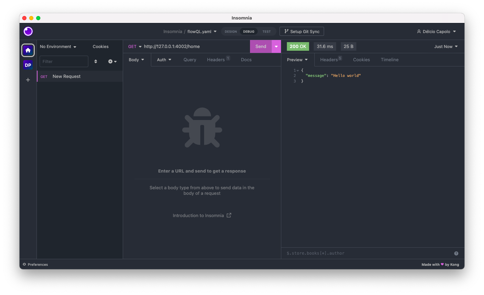
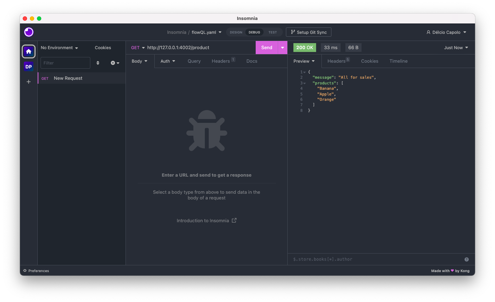
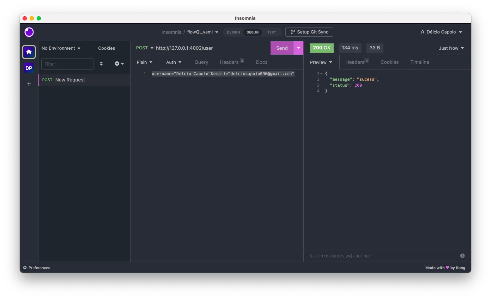
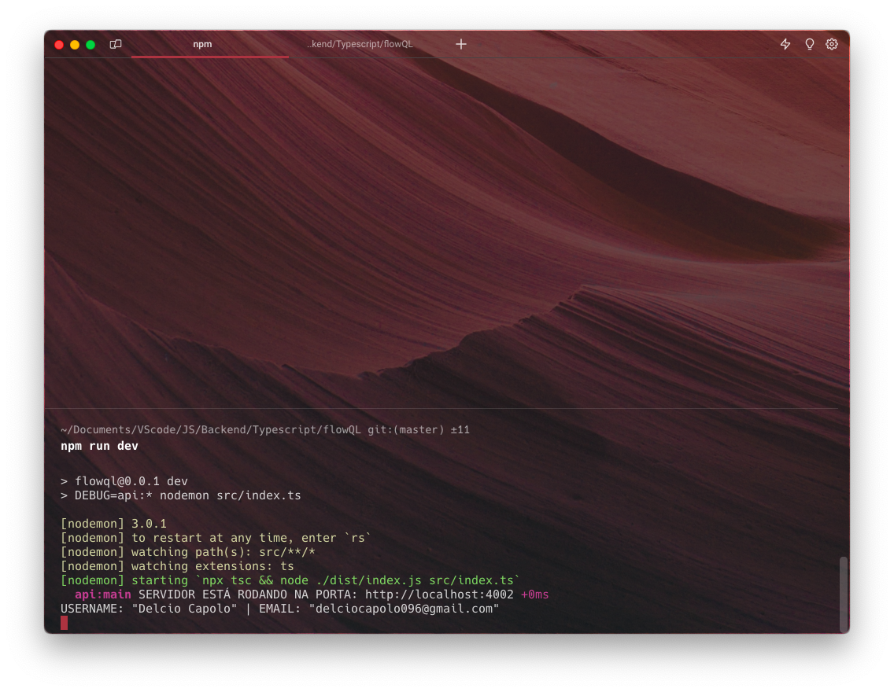
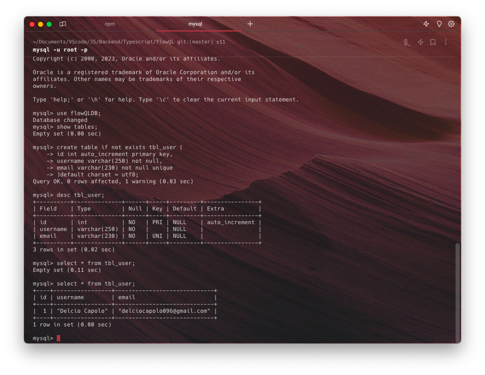
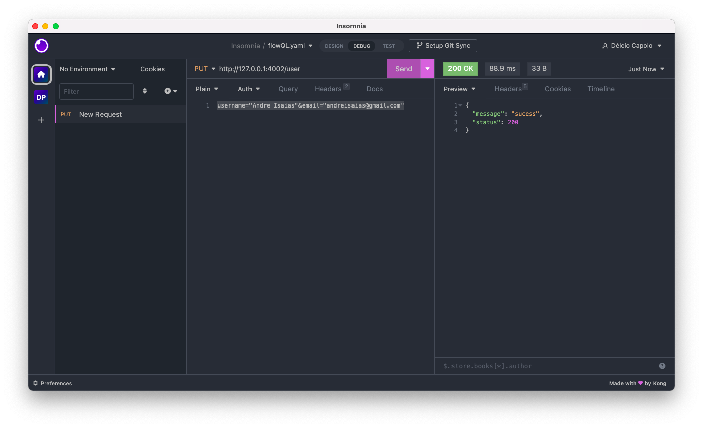
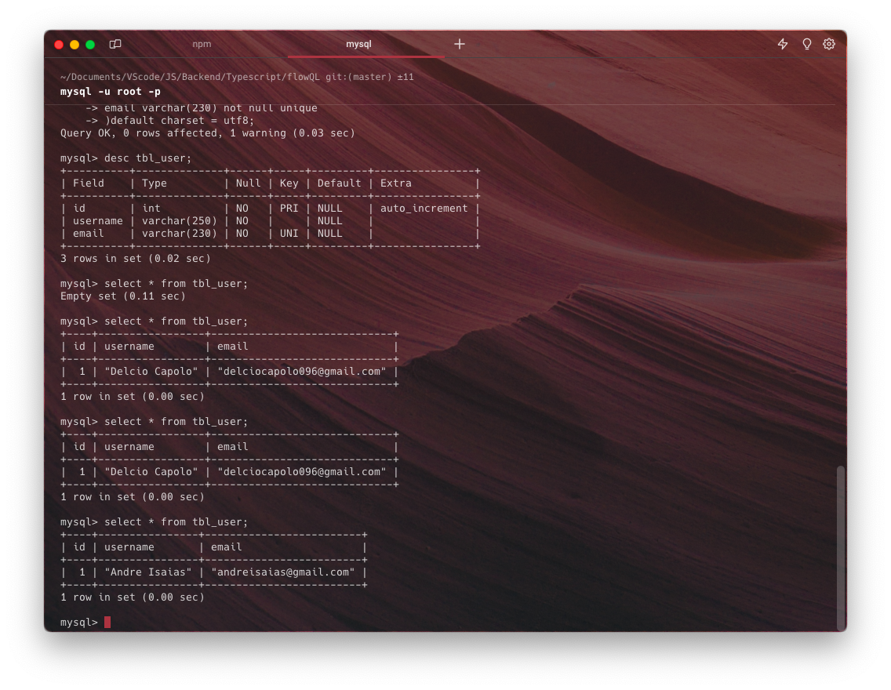

# FlowQL

O **FlowQL** é um projecto Open-source que visa facilitar os CRUDs realizados em REST API. O seu objectivo é fornecer comandos que, de modo simplficado, realizem as tarefas de:
- Obtenção (GET)
- Inserção (POST)
- Atualização (PUT)
- Eliminação (DELETE)

Estes comandos são fornecidos através de uma **Classe Server** com as respectivas operações [GET, POST, PUT, DELETE]. E Para não limitar o desenvolvedor na sua tarefa de manipular os dados que trafegam pela rota definida nos parâmetros da função/método, o desenvolvedor tem a sua desposição parâmetros da função que retornam os dados para, o mesmo, manipular estes respectivos dados conforme a sua necessidade. E dispõe, para si, também, funções que o ajudem a realizar estas operações, como *inserir dados, no banco de dados*, *eliminar dados, do banco de dados*, *atualizar dados, no banco de dados* e outros mais.
<br>
## Verbos http e seus métodos na classe 
### GET <br> 
> Utilizado para obtenção de dados da API. <br>

Este método apresenta duas formas de implementação: <br> 
1. ```javascript
    import server from "flowQL";

    server.get(["/home/product", "product"]);

    server.listen(3333);
    ```
    
    Passando como parâmetro, um **Array de string**(Padrão). Em que o valor nas strings será a rota. E ao acessar esta rota, obteremos como resposta ,padrão, do servidor, um objecto com a chave *message*, informando que a rota foi definida.
2. ```javascript
    import server from "flowQL";

    server.get([
    {
        "url":"home", 
        "data": {"message": "Hello world"}
    },
    {
        "url":"product", 
        "data": {
            "msg": "All for sales",
            "usernames": ["Banana", "Apple", "Orange"]
        }
    }
    ]);

    server.listen(3333);
    ```
    1. Rota "/home" GET:
        
    2. Rota "/product" GET:
        
    Passando como valor um **Array de objectos**, a chave "**url**", é responsável por receber uma string que será a rota. A chave "**data**" receberá um objecto, em que nele o desenvolvedor poderá definir qual será a resposta do servidor, para a rota acessada.

### POST <br> 
> Utilizado para obtenção de dados da API. <br>

Há duas formas de implementação, com este método. Sendo eles, ***freeHands*** e ***closeHands***. Sendo que **freeHands** representa o método *post* sem uma conexão com banco de dados, já o **closeHands** é o caso contrário. Ou seja, é o método *post* com uma conexão com o banco de dados, nele sendo possível inserir dados no banco dados, utilizando um método nativo da função.
1. freeHands: 
    ```javascript
    import server from "flowQL";

    server.post(
    [
        {
            "url": "/user",
            params({ obj_body, validate }) {
                if(validate) {
                    const { username, email } = Object(obj_body);
                    
                    console.log(username, email);
                }
            }
        }
    ]
    );

    server.listen(3333);
    ```
    1. Rota "/user" POST:
        
        Resultado no terminal:
        
    * **obj_body** - é o body, ou seja, o corpo da requisição.
    * **validate** - é uma propriedade boolean. Responsável por verificar se todos os valores do corpo da requição sáo válidos.
    > E se observarem com atenção, o método *post* recebe dois parâmetros. **urls**, que nela contem a configuração das rotas e a forma de manipular o corpo da requisição.

2. closeHands:
    ```javascript
    import server from "flowQL";

    const configDB = {
        "database": "seu_banco_de_dados", 
        "host": "seu_host(localhost/remote)",
        "user": "tipo_de_usuario(root)",
        "password": "sua_palavra_de_usuario"
    };

    server.post(
    [
        {
            "url": "/user",
            params({ obj_body, validate, insertOnTable }) {
                if(validate) {
                    const { username, email } = Object(obj_body);

                    insertOnTable(
                        "your_table_name", 
                        ["column1","column2"], 
                        [value1, value2]
                    );
                }
            }
        }
    ], 
    configDB
    );

    server.listen(3333);
    ```
    Rota "/user" POST (com Banco de Dados):
    
    Schema da tabela do Banco de Dados e registo inserido:
    
    * **obj_body** - é o body, ou seja, o corpo da requisição.
    * **validate** - é uma propriedade boolean. Responsável por verificar se todos os valores do corpo da requição sáo válidos.
    * O segundo parâmetro da função *post* são os parâmetros de conexão com banco de dados.
    > Apenas suporta o SGBD, MySQL.

### PUT <br> 
> Utilizado para obtenção de dados da API. <br>

Há duas formas de implementar o método put,sendo elas ,também, ***freeHands*** e ***closeHands***.
1. freeHands:
    ```javascript
    import server from "flowQL";

    server.put(
    [
        {
            "url": "user",
            changeOnTable({ obj_body, validate, transformKeys, transformValues }) {
                if(validate) {
                    const keys = transformKeys(obj_body);
                    const values = transformValues(obj_body);

                    console.log(keys);
                    console.log(values);

                    // Ou podemos simplesmente:
                    console.log(obj_body);
                }
            }
        }
    ]
    );

    server.listen(3333);
    ```
2. closeHands:
    ```javascript
    import server from "flowQL";

    const configDB = {
        "database": "seu_banco_de_dados", 
        "host": "seu_host(localhost/remote)",
        "user": "tipo_de_usuario(root)",
        "password": "sua_palavra-passe_de_usuario"
    };

    server.put(
        [
            {
                "url": "user",
                changeOnTable({ obj_body, validate, changeOn, transformKeys, transformValues }) {
                    const keys = transformKeys(obj_body);
                    const values = transformValues(obj_body);

                    if(validate) {
                        changeOn({
                            "tbl_name": "tbl_user", 
                            "columnID": "id", 
                            "columns": keys, 
                            "values": values, 
                            "id": 1
                        });
                    }
                },
            }
        ],
        configDB
    );

    server.listen(3333);
    ```
    
    Resultado no Banco de Dados(Atualizados):
    
    > Observações:
    1. **obj_body** - contem nele o corpo da requisição
    2. **validate** - verifica se todos os valores do corpo da requição são válidos.
    3. **changeOn** - função responsável por alterar o registo no banco de dados. Parâmetros:
        1. **tbl_name** - nome da tabela, no banco de dados.
        2. **columnID** - coluna/campo, responsável por armazenar a identificação (única) dos registos. O padrão é id.
        3. **columns** - recebe um array de string, que nas strings, deve conter o valor dos campos que atualizarão o registo.
        4. **values** - recebe um array de string, que nas strings deve conter o valor que será atualizado no registo.
        5. **id** - recebe um valor(string/number), que é a identificação (única), do registo.
    4. **transformKeys** - esta função retorna um array de strings, contendo os campos que atualizarão o registo na tabela.
        > Estes são extraídos do objecto que o usuário enviou na requisição.
    5. **transformValues** - esta função retorna um array de strings, contendo os valores que atualizarão os campos do registo.
        > Estes são extraídos do objecto que o usuário enviou na requisição.

### DELETE <br>

> Utilizado para obtenção de dados da API. <br>

Tal como os outros métodos(POST e PUT), o delete também possui duas implementações(freeHands e closeHands).

1. freeHands:
    ```javascript
    import server from "flowQL";
    
    server.delete(
        [
            {
                "url": "/user",
                deleteOnTable({ obj_body }) {
                    const { del } = Object(obj_body);
                    console.log(del);
                },
            }
        ]
    );

    server.listen(3333);
    ```
    * O parâmetro, **obj_body**, retorna um objecto contendo as querys da URI e seus respectivos valores.
2. closeHands:
    ```javascript
    import server from "flowQL";

    server.delete(
        [
            {
                "url": "/user",
                deleteOnTable({ obj_body, deleteOn }) {
                    const { del } = Object(obj_body);
                    deleteOn({"tbl_name": "tbl_user", "columnID": "id", "id": del});
                },
            }
        ],
        configDB
    ) ;

    server.listen(3333);
    ```
    * O parâmetro, **deleteOn**, é uma função responsável por eliminar um registo do banco de dados, de acordo os valores fornecidos nos parâmetros.
        1. tbl_name - recebe uma string com o nome da tabela no banco de dados.
        2. columnID - recebe, como valor, uma string que com o nome da coluna/campo, responsável por armazenar a identificação (única) dos registos. O padrão é id.
        3. id - recebe um valor(string/number), que é a identificação (única), do registo.

> ***Observações:*** <br> - As rotas definas, tanto no **Array de strings** como na propriedade **url**, podem iniciar a sua declaração com a barra invertida(/) ou sem a mesma. <br> - Actualmente, o único SGBD suportado é o MySQL.